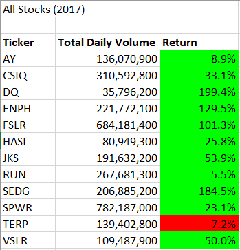

# An Analysis of 2017 and 2018 Stocks

## Overview of Project
### This project analyzes stock data from the year 2017 and 2018 to see how frequently each stock was traded and how well each stock performed over the course of the year. The results of this analysis should provide insight into the merits of each stock and whether or not it is advisable to invest in a particular stock. The original analysis has been refactored with the aim to perform future analyses faster. The merits of the refactored code will be discussed in the Summary Section.

## Results

## Summary
