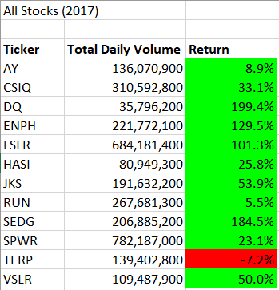
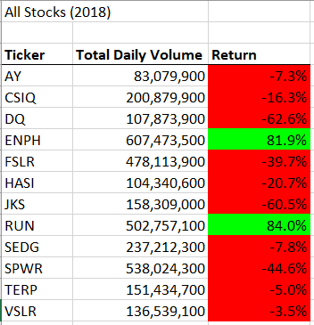
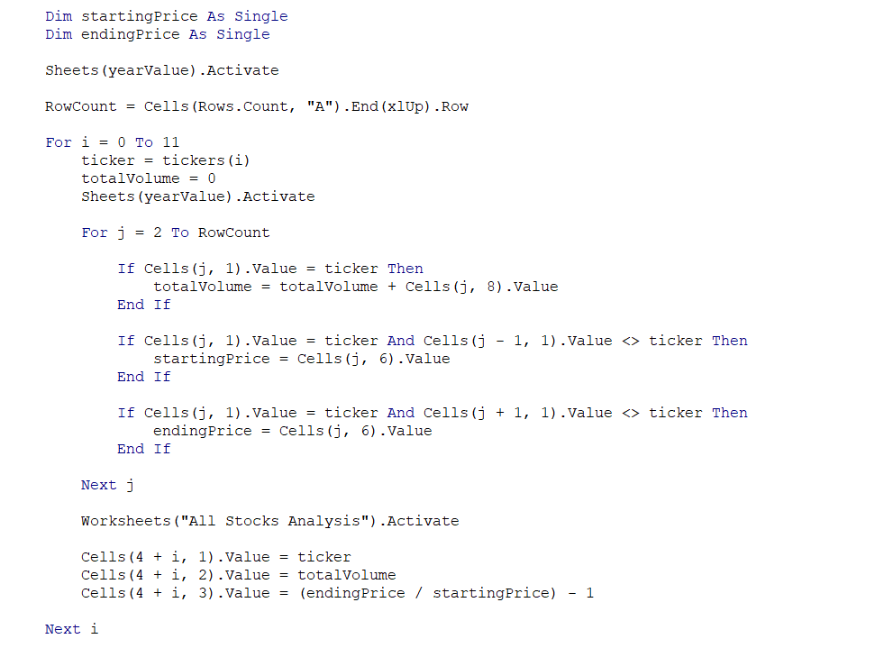
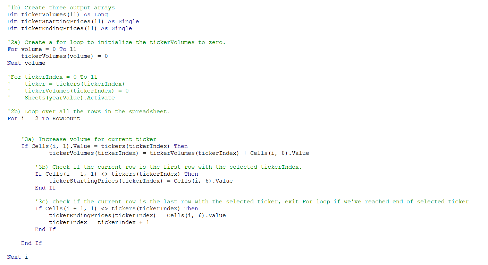
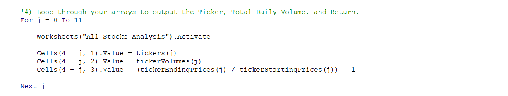
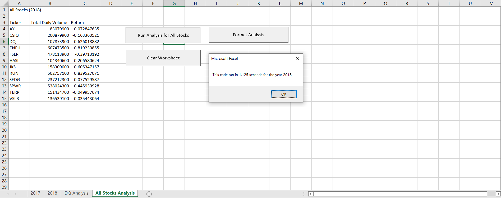
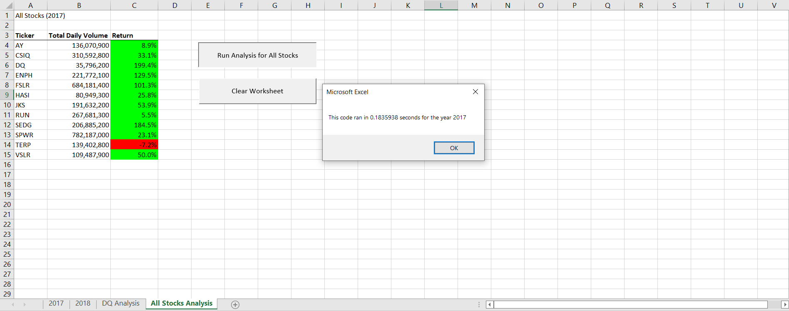

# An Analysis of 2017 and 2018 Stocks

## Overview of Project
### This project analyzes stock data from the year 2017 and 2018 to see how frequently each stock was traded and how well each stock performed over the course of the year. The results of this analysis should provide insight into the merits of each stock and whether or not it is advisable to invest in a particular stock. The original analysis has been refactored with the aim to perform future analyses faster. The merits of the refactored code will be discussed in the Summary Section.

## Results

The results of the stock analysis performed can be seen in the two charts above which display the total volume of stock traded and the percentage return for each stock in the years 2017 and 2018. The color coding on the charts makes it easy to see at a glance that the stocks performed overwhelmingly better in 2017 than they did in 2018, with the exception of ENPH which performed better in 2018. When comparing volume traded, we see that a little over 50% of the stocks traded at a higher volume in 2018 than they did in 2017.

We were able to process the over 3000 rows of data and get this analysis within seconds thanks to our use of a VBA script. In our original code, we processed the data using a nested For loop which runs through all the rows of each stock and ascertains its starting and ending price and sums up its total daily volumes. The percentage return for each stock is then calculated by dividing the ending price by the starting price and subtracting 1. The two calculated values for each stock are then added to the All Stocks Analysis worksheet before moving on to the calculations for the next stock. This approach can be seen in the code on the image above.

We refactored our original code with the hopes of making the script run faster so that we can eventually handle larger data sets. The refactored code only loops through the data a single time while storing the total volume, starting price, and ending price in separate arrays which are then printed in one sweep on the analysis worksheet. This approach allows us to save time by not having to run through the data separately for each stock, as well as not having to switch between the data worksheet and the analysis worksheet to print the result of each stock. The For loop collecting the necessary data can be seen in the code snippet above, while the For loop printing the data from the arrays onto the analysis worksheet can be seen below.

Ultimately, our refactored code does run faster than the original code. We are able to see this by adding a timer to each code as well as a message box that tells us how long it took for the code to run. While the code takes a slightly different amount of time to run on each iteration, the screen shots below show that the difference between the run time of the original code and the refactored code is significant. While the original code was not able to process the data for 2017 or 2018 faster than 1.12 seconds, the refactored code was able to run in about .18 seconds at its best. We saved almost a whole second of processing time!

## Summary

##### Advantages and Disadvantages of Refactoring Code

Refactoring code has the advantage of leading to a more elegant solution to a coding problem and creating code that takes less time to run than the original code. Code that runs faster becomes more versatile as it can be used to process larger amounts of data. More elegant code can be more easily maintained and added to in the case that the program needs to be extended.

However, refactoring can be time consuming and imprecise refactoring could lead to new bugs and errors making the code less functional than before. 

##### Advantages and Disadvantages of Refactored Stock Analysis

In this case, while refactoring the code did take additional time, the results were worth the effort. The refactored code runs significantly faster than the original code, which would allow us to process much larger quantities of data faster. The refactored code also completes the analysis of the data in a more elegant manner, completing all of the tasks necessary in one worksheet before moving to the next sheet, instead of flipping back and forth between the two multiple times. 
